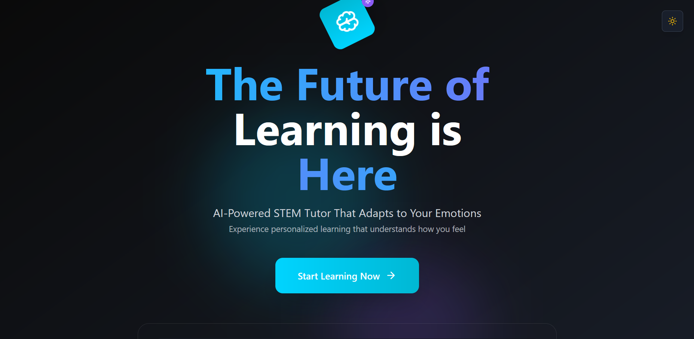

# AffectLearn: A Sentiment-Aware Adaptive STEM Tutor

AffectLearn is a cutting-edge, AI-powered educational platform that delivers personalized STEM tutoring by dynamically adapting explanations, quizzes, and instructional tone based on the learner’s emotional state. Combining LoRA-tuned language models, multimodal emotion recognition, and retrieval-augmented content generation, AffectLearn creates a truly human-like, empathetic digital learning assistant.

---

## ✨ Key Features

-   **LoRA-Tuned LLMs:** Lightweight, instruction-optimized TinyLLaMA model for STEM Q&A and explanations, fine-tuned on AllenAI ARC and SciQ datasets.
-   **Multimodal Emotion Recognition:** Real-time adaptation using text sentiment (RoBERTa), speech-to-text transcription (Whisper), and facial stress analysis from webcam feeds (FER2013-trained CNN).
-   **Retrieval-Augmented Generation (RAG):** Ensures factual and curriculum-aligned answers by retrieving relevant content from OpenStax textbooks indexed by FAISS.
-   **Dynamic Quiz & Explanation Generation:** Adapts quiz complexity and explanation style based on the user's detected emotional state (e.g., stress, confusion) and cognitive performance.
-   **Personalized Feedback Loop:** Learner sentiment and performance data are stored and analyzed to continuously tailor future interactions, creating an evolving learning environment.
-   **Lightweight & Deployable:** Designed to run efficiently on consumer-grade hardware, requiring as little as an 8GB GPU.

---

## 📂 Folder Structure

```
AffectLearn/
├── backend/
│   ├── ... (FastAPI server, model code, etc.)
├── frontend/
│   ├── docs/
│   │   ├── Screenshot_2025-07-20_094902.png    # Landing page screenshot
│   │   ├── Screenshot_2025-07-20_100551.png    # Chat and quiz interface screenshot
│   ├── ... (Next.js frontend code)
├── README.md
├── requirements.txt
├── ... (other project files)
```

---

## 📸 Screenshots

### Landing Page



### Chat and Quiz Interface


---

## 🚀 Getting Started

### Prerequisites

-   Python 3.11+
-   Node.js and npm
-   CUDA-capable GPU (NVIDIA RTX 4060 8GB or equivalent recommended)
-   Libraries: PyTorch, Hugging Face Transformers, FAISS, OpenAI Whisper
-   Frontend Framework: Next.js
-   Database: Supabase

### Backend Setup

```bash
# Navigate to the backend directory
cd backend

# Install required Python packages
pip install -r requirements.txt

# (Optional) Edit your environment/configuration files as needed

# Run the backend server
python main.py
```

### Frontend Setup

```bash
# Navigate to the frontend directory
cd frontend

# Install required Node packages
npm install

# Start the development server
npm run dev
```

---

## 🖥️ Usage

1.  Ensure both the backend and frontend servers are running.
2.  Open your browser and navigate to `http://localhost:3000`.
3.  Interact with the AI tutor using the chat interface. You can provide input via text, voice, or enable your webcam for facial stress detection.
4.  The system will provide explanations and generate quizzes tailored to your real-time emotional and cognitive state.
5.  View your sentiment trends and topic mastery on the analytics dashboard.

---

## ⚙️ How it Works

AffectLearn's architecture is designed for real-time, emotionally intelligent tutoring:

1.  **Input:** The user interacts with the system via text, voice, or webcam. Voice inputs are transcribed to text using OpenAI Whisper, and webcam feeds are analyzed for stress by a custom CNN.
2.  **Emotion Processing:** Text inputs (from chat or voice) are analyzed for sentiment using a RoBERTa model. These sentiment scores, along with stress levels from the webcam, create a multimodal emotional profile of the learner.
3.  **RAG & LLM Generation:** When a user asks a question, FAISS retrieves relevant passages from an indexed OpenStax textbook corpus. This context, along with the user's query and emotional state, is fed into a LoRA-tuned TinyLLaMA model, which generates a factually grounded and emotionally adaptive response.
4.  **Feedback Loop:** All interaction data, including sentiment scores, stress levels, and quiz performance, is stored in a Supabase backend. This data powers a feedback loop that personalizes subsequent interactions, making the system progressively more attuned to the individual learner.
5.  **Output:** The generated explanation or quiz is displayed on the Next.js frontend, which also includes an analytics dashboard for tracking learning progress and emotional trends.

---

## 📜 Publications

If you use this project in your research, please cite our paper:

Kowshik Padala, Thota Rahul, Peruri Teja Sai Sathwik, and Simi Surendran. "AffectLearn: A Sentiment-Aware Adaptive STEM Tutor with LORA-Tuned Instructional LLMs and Multimodal Emotion Feedback." *In Proceedings of the CIMA 2025 Conference.*

---

## ⚖️ License

This project is released under the MIT License.

---

## 📧 Contact

For questions, feedback, or collaborations, please contact the authors at:
`{am.en.u4cse22245, am.en.u4cse22257, am.en.u4cse22271}@am.students.amrita.edu` or `simi@am.amrita.edu`.
